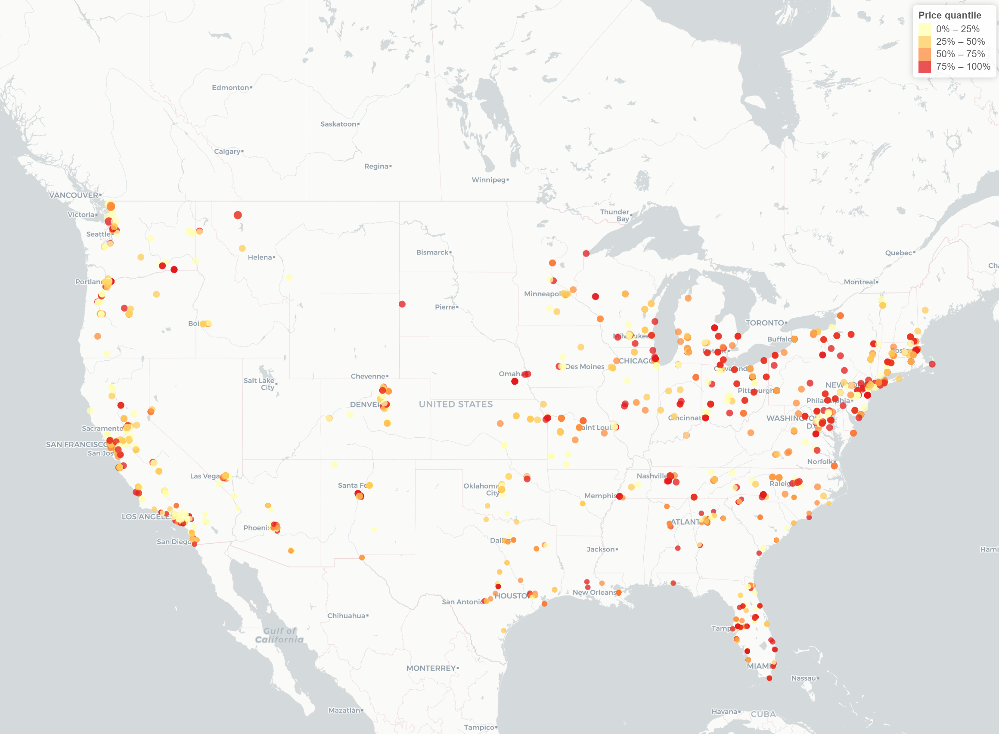

---
title: "2021 Craigslist used electric cars price Prediction"
author: "Zheyan Liu (zl3119)"
output:
  pdf_document:
    toc: yes
    toc_depth: 2
  html_document:
    df_print: paged
    toc: yes
    toc_depth: '2'
editor_options: 
  chunk_output_type: console
--- 

\newpage


```{r setup, include=FALSE}
library(tidyverse)
library(caret)
library(patchwork)
library(leaflet)

knitr::opts_chunk$set(
  fig.width = 6,
  fig.asp = .7,
  out.width = "95%"
)

theme_set(theme_minimal() + theme(legend.position = 'bottom'))

options(
  ggplot2.continuous.colour = 'viridis',
  ggplot2.continuous.fill = 'viridis'
)

scale_colour_discrete = scale_colour_viridis_d
scale_fill_discrete = scale_fill_viridis_d
```

# Introduction

```{r, include=FALSE}
df_raw = read_csv('data/vehicles.csv', show_col_types = FALSE)
df = 
  df_raw %>% 
  filter(fuel == 'electric') %>% 
  filter(
      # price > quantile(price,0.02),
      # price < quantile(price,0.98)
    )

df1 = 
df %>% 
    select(price, year, manufacturer, condition, odometer, title_status, transmission,drive, type, paint_color, state, lat, long) 

# as.data.frame(sapply(X = df2, FUN = function(x) sum(is.na(x)))/nrow(df2))  %>% knitr::kable(col.names = "Missing rate")
# 
# range(df %>% drop_na(long) %>% pull(long))
# 
# str(df2)
# 
# length(table(df2$paint_color))
# 
# table(df2$paint_color)
```


With the soaring oil price, more and more people are considering buying an electric car to save money. We would like to build models to help predict the used electric car price so that customers can use this model to determine whether the deal is reasonable. 


We used data from [Craigslist](https://newyork.craigslist.org/), which is the world's largest collection of used vehicles for sale. The [original data](https://www.kaggle.com/datasets/austinreese/craigslist-carstrucks-data) contains price of used car from Apr 2011 to May 2011, it contains `r nrow(df_raw)` observations and  `r ncol(df_raw)` variables. Since we are only interested in cars fueled by electricity, data is reduced to `r nrow(df)` observations.


## Research Questions

* Find appropriate way to handle missing values.

* Conduct exploratory data analysis to find interesting facts about the data.

* Build and compare machine learning models to find the best one for the prediction task.

## Data preparation

We drop variables that has missing rate higher than 35%. For variables with relatively high missing rate (>2%), we analyze the missing pattern, whether they are MAR or MNAR. For MNAR categorical variables, missingness is treat as an attribute *NAN_cat*. For MAR categorical variables, missing values are imputed with mode. After selection and imputation, the final variables for model are as follow

| Variable     | Type       | levels/range   | Missing rate | Missing type | Impute method   |
|--------------|------------|----------------|--------------|--------------|-----------------|
| Price        | continuous | 0-130000       | 0            | NA           | NA              |
| Year         | continuous | 1901-2022      | 0.2%         | MAR          | Median          |
| Odometer     | continuous | 0-1111111      | 0.3%         | MAR          | Median          |
| Lat          | continuous | 19.64-61.57    | 1.8%         | MAR          | Median          |
| Long         | continuous | -159.37--70.06 | 1.8%         | MAR          | Median          |
| Manufacturer | category   | 29 levels      | 4.8%         | MNAR         | NA as attribute |
| Condition    | category   | 6 levels       | 31.6%        | MNAR         | NA as attribute |
| Title_status | category   | 6 levels       | 1.5%         | MNAR         | NA as attribute |
| Transmission | category   | 3 levels       | 1.1%         | MAR          | Mode            |
| Drive        | category   | 3 levels       | 19.9%        | MAR          | Mode            |
| Type         | category   | 11 levels      | 10.1%        | MAR          | Mode            |
| State        | category   | 49 levels      | 0            | NA           | NA              |
| Paint_color  | category   | 11 levels      | 26.4%        | MAR          | Mode            |

*Manufacturer*, *Title_status* and *Condition* are considered MNAR because the records with missing values clearly has lower price compared to other category.

# Exploratory data analysis

We discovered some interesting facts through visualization. Note that all the exploratory data analysis are based on the raw data without imputation.

## Interesting price distribution


```{r, fig.asp=0.6, echo=FALSE}
p1 = 
  df %>% 
    ggplot(aes(x=price)) + geom_histogram(bins=35,color="darkorchid4", fill="darkorchid4") +
    labs(y="count", x="price of all cars")

p2 = 
  df %>% 
    filter(manufacturer=='tesla') %>% 
    ggplot(aes(x=price)) + geom_histogram(bins=30,color="darkgoldenrod2", fill="darkgoldenrod2")+ 
    labs(y="count", x="price of Tesla")

p1 + p2
```

From the first price histogram, there is clearly two vertices of the price, and the price is relatively skewed to the left. The reason is that 689 out of 1698 observations in the dataset is manufacturered by Tesla, and Tesla has a higher price than most of other brands. 

In addition, there are some errorness in the dataset, it contains some prices equal or very close to 0. We remove the 7% lowest price records in the dataset (7% quantile on price is quantile(df$price, 0.07)).

## Price vs category variables

```{r, fig.height = 32, fig.width = 8, fig.asp=1, echo=FALSE}
p1 = 
  df1 %>% 
    group_by(paint_color) %>% 
    mutate(n = n()) %>% 
    drop_na(paint_color) %>% 
    filter(n >= 30) %>% 
    ggplot(aes(x=reorder(paint_color, price, median, na.rm = TRUE), y=price, fill=paint_color)) + 
    geom_boxplot() + theme(axis.text.x = element_text(angle = 90, vjust = 0.5, hjust=1)) + 
    theme(legend.position = "none") + 
    labs(y="price", x="paint_color")

p2 = 
  df1 %>% 
    group_by(type) %>% 
    mutate(n = n()) %>% 
    drop_na(type) %>% 
    filter(n >= 30) %>% 
    ggplot(aes(x=reorder(type, price, median, na.rm = TRUE), y=price, fill=type)) + 
    geom_boxplot() + theme(axis.text.x = element_text(angle = 90, vjust = 0.5, hjust=1)) + 
    theme(legend.position = "none") + 
    labs(y="price", x="type")

p3 = 
  df1 %>% 
    group_by(manufacturer ) %>% 
    mutate(n = n()) %>% 
    drop_na(manufacturer ) %>% 
    filter(n >= 30) %>% 
    ggplot(aes(x=reorder(manufacturer , price, median, na.rm = TRUE), y=price, fill=manufacturer)) + 
    geom_boxplot() + theme(axis.text.x = element_text(angle = 90, vjust = 0.5, hjust=1)) + 
    theme(legend.position = "none") + 
    labs(y="price", x="manufacturer ")

p4 = 
  df1 %>% 
    group_by(condition) %>% 
    mutate(n = n()) %>% 
    drop_na(condition) %>% 
    filter(n >= 30) %>% 
    ggplot(aes(x=reorder(condition , price, median, na.rm = TRUE), y=price, fill=condition)) + 
    geom_boxplot() + theme(axis.text.x = element_text(angle = 90, vjust = 0.5, hjust=1)) + 
    theme(legend.position = "none") + 
    labs(y="price", x="condition")

p5 = 
  df1 %>% 
    group_by(drive) %>% 
    mutate(n = n()) %>% 
    drop_na(drive) %>% 
    filter(n >= 30) %>% 
    ggplot(aes(x=reorder(drive  , price, median, na.rm = TRUE), y=price, fill=drive)) + 
    geom_boxplot() + theme(axis.text.x = element_text(angle = 90, vjust = 0.5, hjust=1)) + 
    theme(legend.position = "none") + 
    labs(y="price", x="drive ")

p6 = 
  df1 %>% 
    group_by(transmission) %>% 
    mutate(n = n()) %>% 
    drop_na(transmission) %>% 
    filter(n >= 30) %>% 
    ggplot(aes(x=reorder(transmission, price, median, na.rm = TRUE), y=price, fill=transmission)) + 
    geom_boxplot() + theme(axis.text.x = element_text(angle = 90, vjust = 0.5, hjust=1)) + 
    theme(legend.position = "none") + 
    labs(y="price", x="transmission")

p7 = 
  df1 %>% 
    group_by(state) %>% 
    mutate(n = n()) %>% 
    drop_na(state) %>% 
    filter(n >= 30) %>% 
    ggplot(aes(x=reorder(state, price, median, na.rm = TRUE), y=price, fill=state)) + 
    geom_boxplot() + theme(axis.text.x = element_text(angle = 90, vjust = 0.5, hjust=1)) + 
    theme(legend.position = "none") + 
    labs(y="price", x="state")

(p1 + p2 + p3)/(p4 + p5+ p6)/p7
```

Despite some common knowledge, here is some interesting factors from these boxplot:

* White cars has the highest price while red ones has the lowest median price. However, prices of red cars are scattered.
* 4wd cars has the highest price and the reason behind this ican be car type. 123 out of 166 4wd cars are SUV and Sedan.
* Electric cars New Jersy has the highest median price while California is one of the states with the lowest median price.

## Price map

<center>



</center>

Most car sales takes place near the Coast or the Great Lakes Region. In addition, the car price in the East Coast is clearly higher than that in the West Coast

# Models

I used Lasso, Regression Tree and Gradient Boosting Tree to predict the price. I used Lasso because there is a considerable number of variables (239 including dummy variables) in the training data. And L1 regularization can help reduce dimension and avoid multicollinearity. In addition, I selected Regression Tree because it is easy to interpret and it captures the interaction between variables. Finally, I adopted the ensemble model GBM to better utilize the good property of tree-based models, a single tree can have high bias while boosting methods fits the residual of last round to gradually reduce bias.

## Model preparation

Conduct model preparation with exact following steps

* Impute the data and divide the data into train set and test set. Test set takes up 20%.
* Using MinMaxScaler to scale all continuous variable in range [0, 1] so that the Lasso coefficients are comparable.
* Remove the 2% records with low price in the training set.

```{r, echo=FALSE}
calc_mode <- function(x){
  
  # List the distinct / unique values
  distinct_values <- unique(x)
  
  # Count the occurrence of each distinct value
  distinct_tabulate <- tabulate(match(x, distinct_values))
  
  # Return the value with the highest occurrence
  distinct_values[which.max(distinct_tabulate)]
}

normalize <- function(x) {
  return ((x - min(x)) / (max(x) - min(x)))
}


df1 = 
  df %>% 
    select(price, year, manufacturer, condition, odometer, title_status, transmission,drive, type, paint_color, state, lat , long) %>% 
    # filter(
    #   price > quantile(price,0.05),
    #   price < quantile(df$price,0.99)
    # ) %>% 
    mutate(
      manufacturer = ifelse(is.na(manufacturer), 'NAN_cat', manufacturer),
      # odometer = ifelse(is.na(odometer), mean(odometer, na.rm=TRUE), odometer),
      title_status = ifelse(is.na(title_status), 'NAN_cat', title_status)
      # year = ifelse(is.na(year), mean(year, na.rm=TRUE), year),
    ) %>% 
    mutate(
      condition = as.factor(condition),
      condition = fct_reorder(condition, price, median),
      
      title_status = as.factor(title_status),
      title_status = fct_reorder(title_status, price, median),
      
      manufacturer = as.factor(manufacturer),
      transmission = as.factor(transmission),
      drive = as.factor(drive),
      type = as.factor(type),
      paint_color = as.factor(paint_color),
      state = as.factor(state)
           ) %>% 
  mutate(
    # category impute
    condition = replace_na(condition, calc_mode(df %>% filter(!is.na(condition))  %>%  pull(condition))),
    title_status = replace_na(title_status, calc_mode(df %>% filter(!is.na(title_status))  %>%  pull(title_status))),
    transmission = replace_na(transmission, calc_mode(df %>% filter(!is.na(transmission))  %>%  pull(transmission))),
    drive = replace_na(drive, calc_mode(df %>% filter(!is.na(drive))  %>%  pull(drive))),
    type = replace_na(type, calc_mode(df %>% filter(!is.na(type))  %>%  pull(type))),
    paint_color = replace_na(paint_color, calc_mode(df %>% filter(!is.na(paint_color))  %>%  pull(paint_color))),
    
    # continuous impute
    odometer = ifelse(is.na(odometer), median(odometer, na.rm=TRUE), odometer),
    year = ifelse(is.na(year), median(year, na.rm=TRUE), year),
    lat = ifelse(is.na(lat), median(lat, na.rm=TRUE), lat),
    long = ifelse(is.na(long), median(long, na.rm=TRUE), long),
    
    # continuous MinMaxScalar
    odometer = normalize(odometer),
    year = normalize(year),
    lat = normalize(lat),
    long = normalize(long)) %>% 
  filter(
    price > quantile(df$price, 0.07)
  )

set.seed(777)
# Create Train and Test
indexTrain = 
  createDataPartition(
    y = df1$price,
    p = 0.8,
    list = FALSE)

train_df = df1[indexTrain,]

train_df = 
  train_df %>% 
      filter(
      price > quantile(df1$price, 0.01),
      price < quantile(df1$price, 0.99))

test_df = df1[-indexTrain,]
```

## Building model and tuning parameters

Use cross validation to select the best parameter or parameter combination for each model.

### Lasso


```{r, echo=FALSE}
lasso.fit <- train(price~.,
                   data = train_df,
                   method = "glmnet",
                   metric = 'RMSE',
                   tuneGrid = expand.grid(alpha = 1, 
                                          lambda = exp(seq(5, -2, length=300))),
                   trControl = trainControl(method = "cv"))

```

The parameter $\lambda$ controls the L1 Regularization, the bigger the $\lambda$, the fewer variables in the model. Set the candidate values of $\lambda$ to be from `r exp(-2)` to `r exp(-5)` with 300 steps, the best-tune $\lambda$ is `r lasso.fit$bestTune[,2]`.

### Regression Tree


```{r, echo=FALSE}
tree.fit <- train(price~.,
                   data = train_df,
                   method = "rpart2", 
                   tuneLength = 10, 
    trControl = trainControl(method = "cv"))

tree.fit$bestTune[,1]
```

The parameter *max tree depth* determines how many splits/leaves the tree can get. A lower *max tree depth* may result in underfitting while a higher *max tree depth* can lead to overfitting. Set the candidate values of parameter to be 1 to 10 with step of 1, the  best-tune *max tree depth* is `r tree.fit$bestTune[,1]`

### Gradient Boosting Regression Tree


```{r, echo=FALSE}
grid<-expand.grid(.n.trees=seq(200,500,by=100),.interaction.depth=seq(2,7,by=1),.shrinkage=c(.05,.1),
                  .n.minobsinnode=10)


gbm.train<-train(price~.,
                 data=train_df,
                 method='gbm',
                 trControl=trainControl(method = "cv"),
                 tuneGrid=grid)

gbm.train$bestTune[, 2]
```

There are several parameters in the GBM model. *num of trees* controls the number of estimators/base-trees in the ensemble model.*interaction depth* is similar to *max tree depth* in the Regression Tree, it determines the highest level of variable interactions allowed while training the model.  *shrinkage* is considered as the learning rate. It is used for reducing, the impact of each additional fitted base-tree. For *num of trees* and *interaction depth*, small value may cost underfitting and the bigger one can result in overfitting while *shrinkage* does just the opposite.

Set the range for *num of trees* to be 200 to 500 with step of 100, the range for *interaction depth* to be 2 to 7 with step of 1 and *shrinkage* to be 0.05 or 0.1. The best-tune *num of trees* is `r gbm.train$bestTune[, 1]`, *interaction depth* `r gbm.train$bestTune[, 2]` is and *shrinkage* is `r gbm.train$bestTune[, 3]`


### Important variables


## Model performance

```{r}
set.seed(777)
res = 
  resamples(list(LASSO = lasso.fit,
                 TREE = tree.fit,
                 GBM = gbm.train))

cv_res = res$values
p1 = 
  cv_res %>% 
    as.tibble() %>% 
    select('LASSO~RMSE', 'TREE~RMSE', 'GBM~RMSE') %>% 
    pivot_longer(c('LASSO~RMSE', 'TREE~RMSE', 'GBM~RMSE'), 
                 names_to = 'model',
                 values_to = 'RMSE') %>% 
    mutate(
      model = ifelse(model=='LASSO~RMSE', 'LASSO', model),
      model = ifelse(model=='TREE~RMSE', 'TREE', model),
      model = ifelse(model=='GBM~RMSE', 'GBM', model),
      model = as.factor(model),
      model = fct_reorder(model, -RMSE, median)
    ) %>% 
    ggplot(aes(x=model, y=RMSE, fill = model)) + geom_boxplot()

pred_y = predict(lasso.fit, newdata = as.tibble(test_df))
rmse = sqrt(mean((pred_y - test_df$price)^2)) 

pred_y = predict(tree.fit, newdata = as.tibble(test_df))
rmse = sqrt(mean((pred_y - test_df$price)^2)) 

pred_y = predict(gbm.train, newdata = as.tibble(test_df))
rmse = sqrt(mean((pred_y - test_df$price)^2)) 


y_compare_df = 
  tibble(pred = pred_y,
         actual = test_df$price) %>% 
  arrange(actual) %>% 
    pivot_longer(
      cols = pred:actual,
      names_to = 'type',
      values_to = 'price'
    ) 

y_compare_df %>% 
  mutate(
    num = seq(1, nrow(y_compare_df)),
    type = as.factor(type)
         ) %>% 
  ggplot(aes(x = num, y = price), color = type) + 
  geom_point(aes(colour = type)) + 
  theme(legend.position="right")

```


## Model Limitations


# Conclusions


# Appendix

